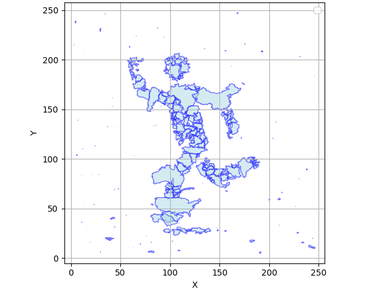
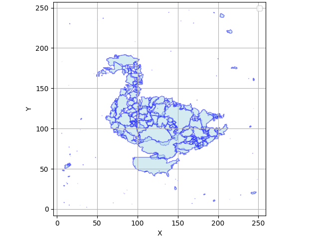
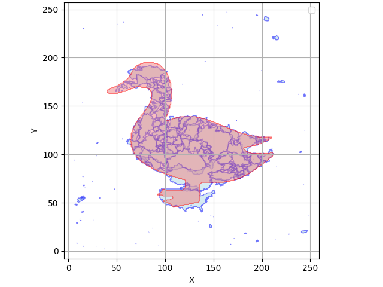
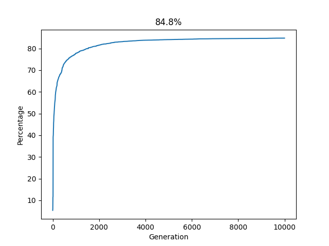
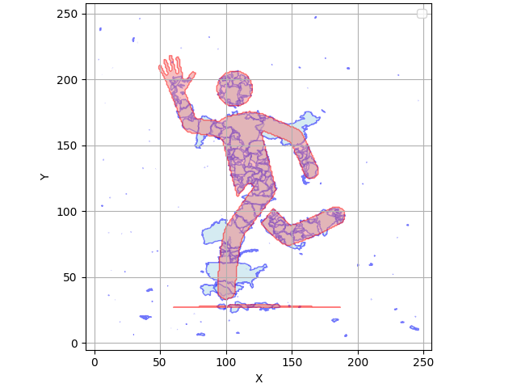
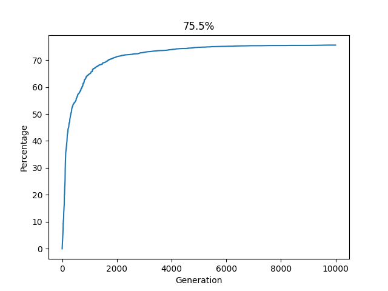

# GEO-SHAPE 
a genetic algorithm that re-arranges the shapes of countries to match other shapes
for example (duck, man, ...)

## Overview
1. first, we will get the target shape as an image from Dalle 3
we can skip it if we
    - have our own shape
    - don't want to update the current target
2. simplify and convert the target into a multi-polygon
3. loading the shapes of the countries and setting the total area of them to match the shape of the target
4. breading with N generation
    - at each generation, we will make random mutations to the position of the countries, with N number of samples
    - evaluate the area covered by the countries on the target shape
    - take top N samples, and if the mean area is more than the previous top N, pass them to the next generation
    - repeat

## Notes
1. chose a lot of countries will make the result better because we can play with details since we can't divide a country in half
2. don't make mutation happen like crazy because this will make a lot of noise, and you can't build on top of your current generations
3. If you want to update the target shape, you need to get an open key, put KEY=$your_key into the .env file, or keep the update target in config set to false

## Examples

### Duck

### Man Running

